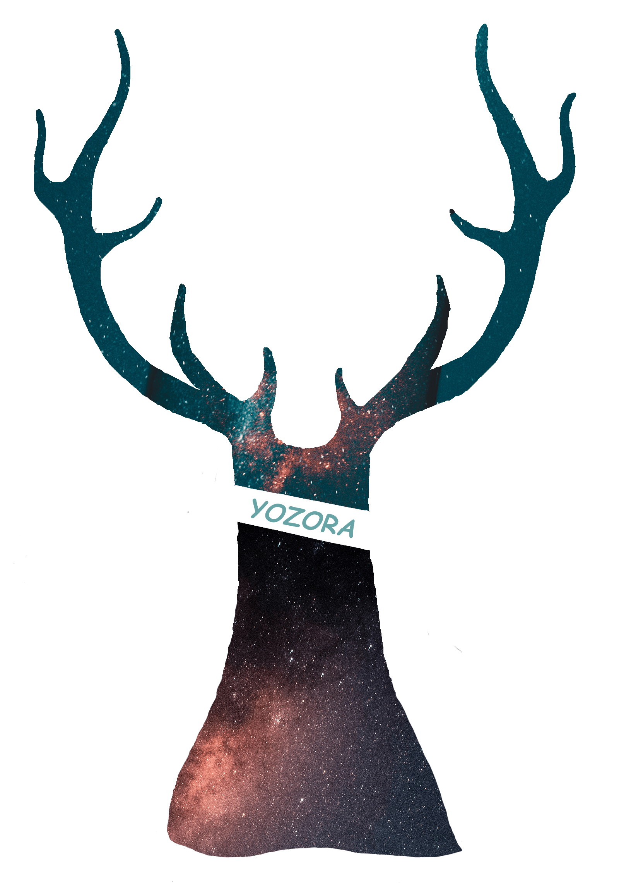

<header>
  <h1 align="center">
    <a href="https://github.com/yozorajs/yozora#readme">Yozora</a>
    <div align="center">
      
    </div>
  </h1>
  <div align="center">
    <a href="#license">
      
    </a>
    <a href="https://github.com/yozorajs/yozora/tags">
      
    </a>
    <a href="https://github.com/yozorajs/yozora/search?l=typescript">
      
    </a>
    <a href="https://github.com/nodejs/node">
      
    </a>
    <a href="https://github.com/yozorajs/yozora/actions/workflows/ci.yml">
      
    </a>
    <a href="https://github.com/facebook/jest">
      
    </a>
    <a href="https://github.com/prettier/prettier">
      
    </a>
  </div>
</header>
<br />

> 参见 [Yozora 文档][yozora-docs] （或 [备用地址][yozora-docs2]） 以获得更多信息。
>
> https://user-images.githubusercontent.com/42513619/129205123-6a1983c4-6a86-4c80-83d6-02bdbf70edbf.mp4

<br />


## 🎉 什么是 "yozora" ?

***yozora*** 是日语「よぞら」的罗马音，意为“夜空”，取自*世界の終わり*乐队的
『*花鳥風月*』中的歌词。

此项目是一个 monorepo，目的是实现一个高度可扩展的、可插拔式 Markdown 解析器。
它采用了中间件的思想，由核心算法 [@yozora/core-parser][] 调度分词器（如
[@yozora/tokenizer-autolink][]）完成解析工作，解析的目标是将 Markdown （及其扩展）
语法的字符串转成抽象语法树（AST）。


## ✨ Features

* 完整支持了 [GFM 规范][gfm-spec] 中提到的所有规则，并通过了几乎所有由规范中的示
  例改造成的测试用例（除了示例 https://github.github.com/gfm/#example-653，因为
  [渲染器][yozora-react] 不打算支持原生的 HTML Tag，所以懒得做标签过滤，如果有需
  要自行做一下过滤就好了）。

  可参见 [@yozora/parser-gfm] or [@yozora/parser-gfm-ex] 以获得进一步信息。

* 健壮性

  - 所有代码都采用 Typescript 编写，拥有严格地静态类型检查的保障；
  - 使用 eslint 和 prettier 约束编码风格，规避了偏僻语法及 shadow variables 之类
    易于出错的问题； 
  - 使用了大量的测试用例进行测试；

* 干净，零第三方依赖。

* 高性能

  - 解析复杂度为字符串长度乘以分词器列表长度，已经达到了理论复杂度的下界；

  - 解析器的 API 支持流式读入（采用生成器/迭代器进行输入），支持边读入边解析
    （暂仅限于块级数据）；

  - 在读入字符串时，会将其预处理成字符编码及位置信息，使用 [NodePoint][src-NodePoint]
    数据类型承载。在分词阶段通过扫描 [NodePoint][src-NodePoint] 的方式完成匹配，
    虽然匹配过程更麻烦些，但理论上性能比正则表达式的匹配方式少一些常数；

  - 小心地处理数组新建/连接操作，整个扫描阶段尽量复用数组，仅通过下标索引来圈定
    匹配范围，并应用了不少策略减少重复匹配/解析操作。
  
* 兼容性，解析器解析出的 AST 与 [Mdast][mdast-homepage] 中定义的相兼容。即便以后
  如果部分数据类型不兼容，也可以很容易通过 [@yozora/ast-util][] 中提供的 API 去
  遍历 AST 以进行适配修改。

* 可扩展性，yozora 采用中间件的方式，由内部算法驱动分词器列表完成解析工作，因而
  易于创建并集成自定义的分词器。此项目中已实现了一些 [GFM][gfm-spec] 中未提到的
  数据类型的分词器，如 [@yozora/tokenizer-admonition][], [@yozora/tokenizer-footnote][]
  等，且均已内置于 [@yozora/parser][] 中。


## Usage

* [@yozora/parser][]: （**推荐**）内置了所有分词器的 Markdown 解析器。

  ```typescript
  import YozoraParser from '@yozora/parser'

  const parser = new YozoraParser()
  parser.parse('source content')
  ```

* [@yozora/parser-gfm][]: 支持 [GFM 规范][gfm-spec] 的 Markdown 解析器。内置了支
  持 [GFM 规范][gfm-spec] 中提到的所有语法（**不包含**规范中提到的扩展语法，如
  [table][@yozora/tokenizer-table]）的分词器。

  ```typescript
  import GfmParser from '@yozora/parser-gfm'

  const parser = new GfmParser()
  parser.parse('github flavor markdown contents')
  ```

* [@yozora/parser-gfm-ex][]: 支持 [GFM 规范][gfm-spec] 的 Markdown 解析器。内置
  了支持 [GFM 规范][gfm-spec] 中提到的所有语法（**包括**规范中提到的扩展语法，如
  [table][@yozora/tokenizer-table]）的分词器。

  ```typescript
  import GfmExParser from '@yozora/parser-gfm-ex'

  const parser = new GfmExParser()
  parser.parse('github flavor markdown contents (with gfm extensions enabled)')
  ```


### Overview

* Parsers

  Parser                    | Description
  :-------------------------|:---------------------------------
  [@yozora/parser][]        | 内置了本仓库所有分词器的 Markdown 解析器
  [@yozora/parser-gfm][]    | 内置了支持 [GFM 规范][gfm-spec] 中提到的所有语法（不包含规范中提到的扩展语法，如 [table][@yozora/tokenizer-table]）的分词器
  [@yozora/parser-gfm-ex][] | 内置了支持 [GFM 规范][gfm-spec] 中提到的所有语法（包括规范中提到的扩展语法，如 [table][@yozora/tokenizer-table]）的分词器

* Tokenizers

  Tokenizer                                 | Description
  :-----------------------------------------|:----------------------------------------------------
  [@yozora/tokenizer-admonition][]          | Resolve admonitions
  [@yozora/tokenizer-autolink][]            | Resolve [GFM Autolinks][gfm-autolink]
  [@yozora/tokenizer-autolink-extension][]  | Resolve [GFM Autolinks (extension)][gfm-autolink-extension]
  [@yozora/tokenizer-blockquote][]          | Resolve [GFM blockquotes][gfm-blockquote]
  [@yozora/tokenizer-break][]               | Resolve [GFM hard line breaks][gfm-hard-line-break] and [GFM soft line breaks][gfm-soft-line-break]
  [@yozora/tokenizer-definition][]          | Resolve [GFM link reference definitions][gfm-link-reference]
  [@yozora/tokenizer-delete][]              | Resolve [GFM strikethrough (extension)][gfm-delete]
  [@yozora/tokenizer-ecma-import][]         | Resolve ECMAScript `import` statements
  [@yozora/tokenizer-emphasis][]            | Resolve [GFM emphasis and strong emphasis][gfm-emphasis]
  [@yozora/tokenizer-fenced-code][]         | Resolve [GFM fenced code blocks][gfm-fenced-code]
  [@yozora/tokenizer-footnote][]            | Resolve footnotes
  [@yozora/tokenizer-footnote-definition][] | Resolve footnote definitions
  [@yozora/tokenizer-footnote-reference][]  | Resolve footnote references
  [@yozora/tokenizer-heading][]             | Resolve [GFM ATX headings][gfm-atx-heading]
  [@yozora/tokenizer-html-block][]          | Resolve [GFM HTML blocks][gfm-html-block]
  [@yozora/tokenizer-html-inline][]         | Resolve [GFM raw HTML][gfm-html-inline]
  [@yozora/tokenizer-image][]               | Resolve [GFM images][gfm-image]
  [@yozora/tokenizer-image-reference][]     | Resolve [GFM reference images][gfm-image-reference]
  [@yozora/tokenizer-indented-code][]       | Resolve [GFM indented code blocks][gfm-indented-code]
  [@yozora/tokenizer-inline-code][]         | Resolve [GFM code spans][gfm-inline-code]
  [@yozora/tokenizer-inline-math][]         | Resolve inline formulas
  [@yozora/tokenizer-link][]                | Resolve [GFM links][gfm-link]
  [@yozora/tokenizer-link-reference][]      | Resolve [GFM reference links][gfm-link-reference]
  [@yozora/tokenizer-list][]                | Resolve [GFM lists][gfm-list]
  [@yozora/tokenizer-list-item][]           | Resolve [GFM list items][gfm-list-item] and [GFM task list items][gfm-list-task-item]
  [@yozora/tokenizer-math][]                | Resolve block formulas
  [@yozora/tokenizer-paragraph][]           | Resolve [GFM paragraphs][gfm-paragraph]
  [@yozora/tokenizer-setext-heading][]      | Resolve [GFM setext headings][gfm-setext-heading]
  [@yozora/tokenizer-table][]               | Resolve [GFM tables][gfm-table]
  [@yozora/tokenizer-text][]                | Resolve [GFM textual contents][gfm-text]
  [@yozora/tokenizer-thematic-break][]      | Resolve [GFM thematic breaks][gfm-thematic-break]

* Utils

  Package                                   | Description
  :-----------------------------------------|:----------------------------------------------------
  [@yozora/ast][]                           | Yozora 中所有的 AST 节点类型
  [@yozora/ast-util][]                      | 处理 AST 的工具函数库
  [@yozora/character][]                     | 处理字符编码的工具库
  [@yozora/core-parser][]                   | Yozora 解析器的核心算法
  [@yozora/core-tokenizer][]                | Yozora 分词器相关的接口和工具函数
  [@yozora/invariant][]                     | A simple invariant function

* Scaffolds

  Package                                   | Description
  :-----------------------------------------|:----------------------------------------------------
  [@yozora/eslint-config][]                 | Yozora 项目的 eslint 配置
  [@yozora/jest-for-tokenizer][]            | 测试分词器的测试库，并包含大量的测试用例
  [@yozora/template-tokenizer][]            | 创建分词器的脚手架工具


## 💡 FAQ

* 如何在 gatsby 中使用 yozora？

  - 参见 [@yozora/gatsby-transformer][] 和 [@yozora/gatsby-images][]

* 如何实现自定义的分词器?

  - 使用脚手架工具 [@yozora/template-tokenizer][] 去创建一个由预定义模板生成的分
    词器项目（或单体项目中的一个包） ；

  - 参见 [@yozora/core-tokenizer][] 以获得分词器的生命周期函数细节；

  - 参见 [@yozora/jest-for-tokenizer][] 以获得测试自定义分词器相关的信息；

  - 参考 [@yozora/core-parser][] 和 [@yozora/parser][] 以获得如何使用自定义分词
    器的信息；

  另外，同样推荐参考现有的 [分词器][github-tokenizers]，以实现一个自定义的版本。
  

## 💬 Contact

* [Github issues](https://github.com/yozorajs/yozora/issues)


## 📄 License

Yozora 使用 [MIT 许可证](https://github.com/yozorajs/yozora/blob/main/LICENSE) 
进行授权。


## Related

* [✨光和尘一直想要一个清爽博客][ghc-post-yozora]: 为什么要写这个项目。
* [@yozora/react-markdown][]: 一个用于将 Yozora AST 渲染成 React 组件的库。
* [@yozora/html-markdown][]: 一个用于将 Yozora AST 渲染成 HTML 字符串的库。


[ghc-post-yozora]: https://me.guanghechen.com/essay/tada/
[gfm-spec]: https://github.github.com/gfm/
[github-tokenizers]: https://github.com/yozorajs/yozora/tree/main/tokenizers
[src-NodePoint]: https://github.com/yozorajs/yozora/blob/main/packages/character/src/types.ts#L10
[yozora-docs]: https://yozora.guanghechen.com/
[yozora-docs2]: https://yozorajs.github.io/
[yozora-react]: https://github.com/yozorajs/yozora-react
[@yozora/gatsby-transformer]: https://github.com/yozorajs/gatsby-scaffolds/blob/main/packages/gatsby-transformer#readme
[@yozora/gatsby-images]: https://github.com/yozorajs/gatsby-scaffolds/blob/main/packages/gatsby-images#readme
[@yozora/html-markdown]: https://github.com/yozorajs/yozora-html/tree/main/packages/markdown
[@yozora/react-markdown]: https://github.com/yozorajs/yozora-react/tree/main/packages/markdown

<!-- :begin use tokenizer/definitions -->

[live-examples]: https://yozora.guanghechen.com/docs/package/root#live-examples
[docpage]: https://yozora.guanghechen.com/docs/package/root
[homepage]: https://github.com/yozorajs/yozora/tree/main/.#readme
[gfm-spec]: https://github.github.com/gfm
[mdast-homepage]: https://github.com/syntax-tree/mdast

[@yozora/ast]:                                https://github.com/yozorajs/yozora/tree/main/packages/ast#readme
[@yozora/ast-util]:                           https://github.com/yozorajs/yozora/tree/main/packages/ast-util#readme
[@yozora/character]:                          https://github.com/yozorajs/yozora/tree/main/packages/character#readme
[@yozora/eslint-config]:                      https://github.com/yozorajs/yozora/tree/main/packages/eslint-config#readme
[@yozora/core-parser]:                        https://github.com/yozorajs/yozora/tree/main/packages/core-parser#readme
[@yozora/core-tokenizer]:                     https://github.com/yozorajs/yozora/tree/main/packages/core-tokenizer#readme
[@yozora/invariant]:                          https://github.com/yozorajs/yozora/tree/main/packages/invariant#readme
[@yozora/jest-for-tokenizer]:                 https://github.com/yozorajs/yozora/tree/main/packages/jest-for-tokenizer#readme
[@yozora/parser]:                             https://github.com/yozorajs/yozora/tree/main/packages/parser#readme
[@yozora/parser-gfm]:                         https://github.com/yozorajs/yozora/tree/main/packages/parser-gfm#readme
[@yozora/parser-gfm-ex]:                      https://github.com/yozorajs/yozora/tree/main/packages/parser-gfm-ex#readme
[@yozora/template-tokenizer]:                 https://github.com/yozorajs/yozora/tree/main/packages/template-tokenizer#readme
[@yozora/tokenizer-admonition]:               https://github.com/yozorajs/yozora/tree/main/tokenizers/admonition#readme
[@yozora/tokenizer-autolink]:                 https://github.com/yozorajs/yozora/tree/main/tokenizers/autolink#readme
[@yozora/tokenizer-autolink-extension]:       https://github.com/yozorajs/yozora/tree/main/tokenizers/autolink-extension#readme
[@yozora/tokenizer-blockquote]:               https://github.com/yozorajs/yozora/tree/main/tokenizers/blockquote#readme
[@yozora/tokenizer-break]:                    https://github.com/yozorajs/yozora/tree/main/tokenizers/break#readme
[@yozora/tokenizer-definition]:               https://github.com/yozorajs/yozora/tree/main/tokenizers/definition#readme
[@yozora/tokenizer-delete]:                   https://github.com/yozorajs/yozora/tree/main/tokenizers/delete#readme
[@yozora/tokenizer-ecma-import]:              https://github.com/yozorajs/yozora/tree/main/tokenizers/ecma-import#readme
[@yozora/tokenizer-emphasis]:                 https://github.com/yozorajs/yozora/tree/main/tokenizers/emphasis#readme
[@yozora/tokenizer-fenced-block]:             https://github.com/yozorajs/yozora/tree/main/tokenizers/fenced-block#readme
[@yozora/tokenizer-fenced-code]:              https://github.com/yozorajs/yozora/tree/main/tokenizers/fenced-code#readme
[@yozora/tokenizer-footnote]:                 https://github.com/yozorajs/yozora/tree/main/tokenizers/footnote#readme
[@yozora/tokenizer-footnote-definition]:      https://github.com/yozorajs/yozora/tree/main/tokenizers/footnote-definition#readme
[@yozora/tokenizer-footnote-reference]:       https://github.com/yozorajs/yozora/tree/main/tokenizers/footnote-reference#readme
[@yozora/tokenizer-heading]:                  https://github.com/yozorajs/yozora/tree/main/tokenizers/heading#readme
[@yozora/tokenizer-html-block]:               https://github.com/yozorajs/yozora/tree/main/tokenizers/html-block#readme
[@yozora/tokenizer-html-inline]:              https://github.com/yozorajs/yozora/tree/main/tokenizers/html-inline#readme
[@yozora/tokenizer-image]:                    https://github.com/yozorajs/yozora/tree/main/tokenizers/image#readme
[@yozora/tokenizer-image-reference]:          https://github.com/yozorajs/yozora/tree/main/tokenizers/image-reference#readme
[@yozora/tokenizer-indented-code]:            https://github.com/yozorajs/yozora/tree/main/tokenizers/indented-code#readme
[@yozora/tokenizer-inline-code]:              https://github.com/yozorajs/yozora/tree/main/tokenizers/inline-code#readme
[@yozora/tokenizer-inline-math]:              https://github.com/yozorajs/yozora/tree/main/tokenizers/inline-math#readme
[@yozora/tokenizer-link]:                     https://github.com/yozorajs/yozora/tree/main/tokenizers/link#readme
[@yozora/tokenizer-link-reference]:           https://github.com/yozorajs/yozora/tree/main/tokenizers/link-reference#readme
[@yozora/tokenizer-list]:                     https://github.com/yozorajs/yozora/tree/main/tokenizers/list#readme
[@yozora/tokenizer-list-item]:                https://github.com/yozorajs/yozora/tree/main/tokenizers/list-item#readme
[@yozora/tokenizer-math]:                     https://github.com/yozorajs/yozora/tree/main/tokenizers/math#readme
[@yozora/tokenizer-paragraph]:                https://github.com/yozorajs/yozora/tree/main/tokenizers/paragraph#readme
[@yozora/tokenizer-setext-heading]:           https://github.com/yozorajs/yozora/tree/main/tokenizers/setext-heading#readme
[@yozora/tokenizer-table]:                    https://github.com/yozorajs/yozora/tree/main/tokenizers/table#readme
[@yozora/tokenizer-text]:                     https://github.com/yozorajs/yozora/tree/main/tokenizers/text#readme
[@yozora/tokenizer-thematic-break]:           https://github.com/yozorajs/yozora/tree/main/tokenizers/thematic-break#readme

[@yozora/react-admonition]:                   https://github.com/yozorajs/yozora-react/tree/main/packages/admonition#readme
[@yozora/react-blockquote]:                   https://github.com/yozorajs/yozora-react/tree/main/packages/blockquote#readme
[@yozora/react-break]:                        https://github.com/yozorajs/yozora-react/tree/main/packages/break#readme
[@yozora/react-delete]:                       https://github.com/yozorajs/yozora-react/tree/main/packages/delete#readme
[@yozora/react-emphasis]:                     https://github.com/yozorajs/yozora-react/tree/main/packages/emphasis#readme
[@yozora/react-code]:                         https://github.com/yozorajs/yozora-react/tree/main/packages/code#readme
[@yozora/react-code-live]:                    https://github.com/yozorajs/yozora-react/tree/main/packages/code-live#readme
[@yozora/react-footnote-definitions]:         https://github.com/yozorajs/yozora-react/tree/main/packages/footnote-definitions#readme
[@yozora/react-footnote-reference]:           https://github.com/yozorajs/yozora-react/tree/main/packages/footnote-reference#readme
[@yozora/react-heading]:                      https://github.com/yozorajs/yozora-react/tree/main/packages/heading#readme
[@yozora/react-image]:                        https://github.com/yozorajs/yozora-react/tree/main/packages/image#readme
[@yozora/react-inline-code]:                  https://github.com/yozorajs/yozora-react/tree/main/packages/inline-code#readme
[@yozora/react-inline-math]:                  https://github.com/yozorajs/yozora-react/tree/main/packages/inline-math#readme
[@yozora/react-link]:                         https://github.com/yozorajs/yozora-react/tree/main/packages/link#readme
[@yozora/react-list]:                         https://github.com/yozorajs/yozora-react/tree/main/packages/list#readme
[@yozora/react-list-item]:                    https://github.com/yozorajs/yozora-react/tree/main/packages/list-item#readme
[@yozora/react-markdown]:                     https://github.com/yozorajs/yozora-react/tree/main/packages/markdown#readme
[@yozora/react-math]:                         https://github.com/yozorajs/yozora-react/tree/main/packages/math#readme
[@yozora/react-paragraph]:                    https://github.com/yozorajs/yozora-react/tree/main/packages/paragraph#readme
[@yozora/react-strong]:                       https://github.com/yozorajs/yozora-react/tree/main/packages/strong#readme
[@yozora/react-table]:                        https://github.com/yozorajs/yozora-react/tree/main/packages/table#readme
[@yozora/react-text]:                         https://github.com/yozorajs/yozora-react/tree/main/packages/text#readme
[@yozora/react-thematic-break]:               https://github.com/yozorajs/yozora-react/tree/main/packages/thematic-break#readme

[doc-live-examples/gfm]:                      https://yozora.guanghechen.com/docs/example/gfm
[doc-@yozora/ast]:                            https://yozora.guanghechen.com/docs/package/ast
[doc-@yozora/ast-util]:                       https://yozora.guanghechen.com/docs/package/ast-util
[doc-@yozora/core-parser]:                    https://yozora.guanghechen.com/docs/package/core-parser
[doc-@yozora/core-tokenizer]:                 https://yozora.guanghechen.com/docs/package/core-tokenizer
[doc-@yozora/parser]:                         https://yozora.guanghechen.com/docs/package/parser
[doc-@yozora/parser-gfm]:                     https://yozora.guanghechen.com/docs/package/parser-gfm
[doc-@yozora/parser-gfm-ex]:                  https://yozora.guanghechen.com/docs/package/parser-gfm-ex
[doc-@yozora/tokenizer-admonition]:           https://yozora.guanghechen.com/docs/package/tokenizer-admonition
[doc-@yozora/tokenizer-autolink]:             https://yozora.guanghechen.com/docs/package/tokenizer-autolink
[doc-@yozora/tokenizer-autolink-extension]:   https://yozora.guanghechen.com/docs/package/tokenizer-autolink-extension
[doc-@yozora/tokenizer-blockquote]:           https://yozora.guanghechen.com/docs/package/tokenizer-blockquote
[doc-@yozora/tokenizer-break]:                https://yozora.guanghechen.com/docs/package/tokenizer-break
[doc-@yozora/tokenizer-delete]:               https://yozora.guanghechen.com/docs/package/tokenizer-delete
[doc-@yozora/tokenizer-emphasis]:             https://yozora.guanghechen.com/docs/package/tokenizer-emphasis
[doc-@yozora/tokenizer-fenced-code]:          https://yozora.guanghechen.com/docs/package/tokenizer-fenced-code
[doc-@yozora/tokenizer-heading]:              https://yozora.guanghechen.com/docs/package/tokenizer-heading
[doc-@yozora/tokenizer-html-block]:           https://yozora.guanghechen.com/docs/package/tokenizer-html-block
[doc-@yozora/tokenizer-html-inline]:          https://yozora.guanghechen.com/docs/package/tokenizer-html-inline
[doc-@yozora/tokenizer-image]:                https://yozora.guanghechen.com/docs/package/tokenizer-image
[doc-@yozora/tokenizer-image-reference]:      https://yozora.guanghechen.com/docs/package/tokenizer-image-reference
[doc-@yozora/tokenizer-indented-code]:        https://yozora.guanghechen.com/docs/package/tokenizer-indented-code
[doc-@yozora/tokenizer-inline-code]:          https://yozora.guanghechen.com/docs/package/tokenizer-inline-code
[doc-@yozora/tokenizer-inline-math]:          https://yozora.guanghechen.com/docs/package/tokenizer-inline-math
[doc-@yozora/tokenizer-link]:                 https://yozora.guanghechen.com/docs/package/tokenizer-link
[doc-@yozora/tokenizer-definition]:           https://yozora.guanghechen.com/docs/package/tokenizer-definition
[doc-@yozora/tokenizer-link-reference]:       https://yozora.guanghechen.com/docs/package/tokenizer-link-reference
[doc-@yozora/tokenizer-list]:                 https://yozora.guanghechen.com/docs/package/tokenizer-list
[doc-@yozora/tokenizer-list-item]:            https://yozora.guanghechen.com/docs/package/tokenizer-list-item
[doc-@yozora/tokenizer-math]:                 https://yozora.guanghechen.com/docs/package/tokenizer-math
[doc-@yozora/tokenizer-paragraph]:            https://yozora.guanghechen.com/docs/package/tokenizer-paragraph
[doc-@yozora/tokenizer-setext-heading]:       https://yozora.guanghechen.com/docs/package/tokenizer-setext-heading
[doc-@yozora/tokenizer-table]:                https://yozora.guanghechen.com/docs/package/tokenizer-table
[doc-@yozora/tokenizer-text]:                 https://yozora.guanghechen.com/docs/package/tokenizer-text
[doc-@yozora/tokenizer-thematic-break]:       https://yozora.guanghechen.com/docs/package/tokenizer-thematic-break
[doc-@yozora/jest-for-tokenizer]:             https://yozora.guanghechen.com/docs/package/jest-for-tokenizer
[doc-@yozora/parser-gfm]:                     https://yozora.guanghechen.com/docs/package/parser-gfm

[gfm-atx-heading]:                            https://github.github.com/gfm/#atx-heading
[gfm-autolink]:                               https://github.github.com/gfm/#autolinks
[gfm-autolink-extension]:                     https://github.github.com/gfm/#autolinks-extension-
[gfm-blockquote]:                             https://github.github.com/gfm/#block-quotes
[gfm-bullet-list]:                            https://github.github.com/gfm/#bullet-list
[gfm-delete]:                                 https://github.github.com/gfm/#strikethrough-extension-
[gfm-emphasis]:                               https://github.github.com/gfm/#can-open-emphasis
[gfm-fenced-code]:                            https://github.github.com/gfm/#fenced-code-block
[gfm-hard-line-break]:                        https://github.github.com/gfm/#hard-line-break
[gfm-html-block]:                             https://github.github.com/gfm/#html-block
[gfm-html-inline]:                            https://github.github.com/gfm/#raw-html
[gfm-image]:                                  https://github.github.com/gfm/#images
[gfm-image-reference]:                        https://github.github.com/gfm/#example-590
[gfm-indented-code]:                          https://github.github.com/gfm/#indented-code-block
[gfm-inline-code]:                            https://github.github.com/gfm/#code-span
[gfm-link]:                                   https://github.github.com/gfm/#inline-link
[gfm-definition]:                             https://github.github.com/gfm/#link-reference-definition
[gfm-link-reference]:                         https://github.github.com/gfm/#reference-link
[gfm-list]:                                   https://github.github.com/gfm/#lists
[gfm-list-item]:                              https://github.github.com/gfm/#list-items
[gfm-list-task-item]:                         https://github.github.com/gfm/#task-list-items-extension-
[gfm-paragraph]:                              https://github.github.com/gfm/#paragraph
[gfm-setext-heading]:                         https://github.github.com/gfm/#setext-heading
[gfm-soft-line-break]:                        https://github.github.com/gfm/#soft-line-breaks
[gfm-strong]:                                 https://github.github.com/gfm/#can-open-strong-emphasis
[gfm-tab]:                                    https://github.github.com/gfm/#tabs
[gfm-table]:                                  https://github.github.com/gfm/#table
[gfm-text]:                                   https://github.github.com/gfm/#soft-line-breaks
[gfm-thematic-break]:                         https://github.github.com/gfm/#thematic-break

<!-- :end -->
